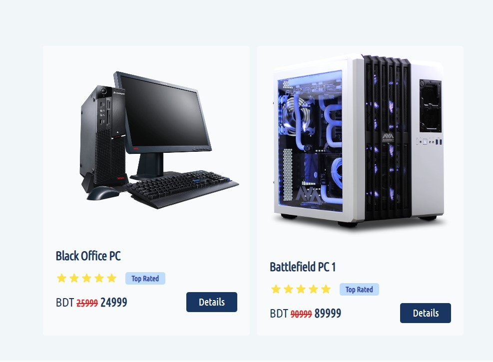
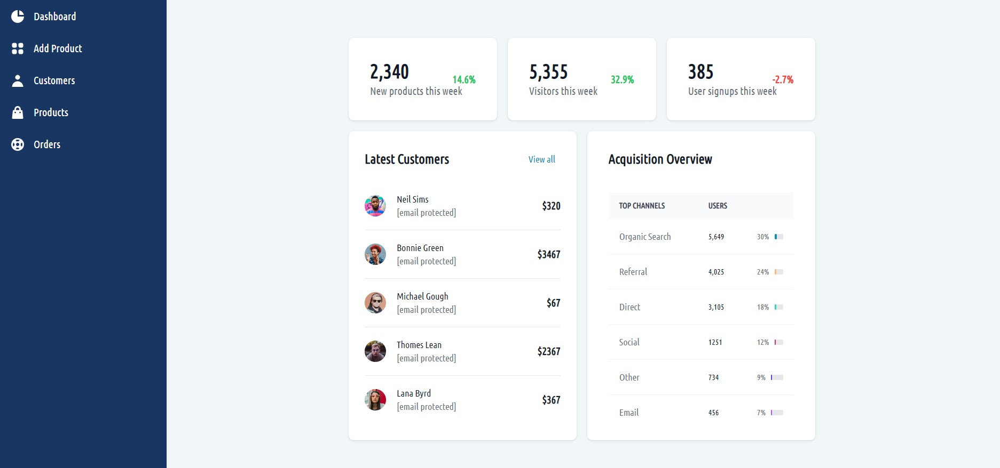

# E - Shop

## Live Site Link : https://e-shop-99.web.app/
## Server Site Code Link : https://github.com/KIShakib/e-shop-server-site

### Features

- A website for pc sell.
- Users can see products for his/her and can book them.
- In cart, the user can see My Orders.
- A seller can give a sell post with all information of his/her product.
- There is also admin system. An admin can control whole website.
- All user+admin are stored in database.
- Products are also stored in database.

### Technologies

- Tailwind ( As CSS Framework )
- React
- Node.js
- Express.js
- MongoDB ( For Database )
- Firebase ( For Authentication )
- NPM
    - React-Router-DOM
    - TanStack
    - Axios
    - Loader Spinner
    - React-Rating
    - Hot-Toast
    - React-Icons
    
- JWT

## Admin 
<> Email : admin@gmail.com
<> Password : 03101999